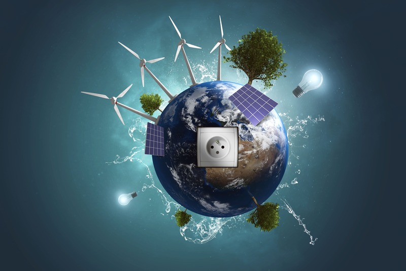

# Group 02 - Global Energy Analysis

## Describe your topic/interest in about 150-200 words

Energy is one of the big global problems we, as a society, are facing. By analyzing energy consumption data, we can shed more light on our current situation and hopefully provide motivation and evidence to support the effort to move towards net-zero emissions.

Some of the specific areas we are looking to explore are shifts in the global energy mix over the past half century. This includes finding which countries have the cleanest overall energy production as well as the most non-renewable energy production. Another topic of interest is the overall change in global energy production and consumption. We will analyze trends in overall renewable energy adoption in addition to more specific renewable energy sources, highlighting the world’s progress in the past 57 years. Finally, we will explore correlations between countries’ GDP and their energy consumption and production. This will let us see which individual energy sources are most common in a given GDP range.

## Describe your dataset in about 150-200 words

The world energy consumption dataset is a global dataset containing a categorized breakdown of energy generation and consumption data from 1965 to 2021. This comprehensive dataset has 22,343 rows and 122 columns providing the information necessary to delve into topics such as energy access, energy production & consumption, energy mix, electricity mix, fossil fuels, renewables, nuclear, and energy transport on a global scale.

This dataset is provided by [Our World in Data](https://ourworldindata.org/), a research and database that aims to "make progress against the world's largest problems". Their goal is to make knowledge on the big problems in our world accessible and understandable. Our World in Data is supported by researchers at the University of Oxford, who are the scientific editors of website content, and the non-profit organization, Global Change Data Lab, who publish and maintain the website and data tools to make the interface user friendly. All data produced by Our World in Data is open access under the Creative Commons BY license. Data is sourced from **four main sources**: **specialized institutes**, such as the Peace Research Institute Oslo (PRIO), **research articles**, **International institutions** or **statistical agencies**, like OECD, World Bank, and UN institutions, and **official data from government sources**. Original data sources are cited in all presented data.

## Team Members

- Michael Somppi: I'm an electrical engineering student interested in power systems and modernizing the electric grid to better support renewable energy sources.
- Abijeet Dhillon: I'm a second year computer science student at the University of British Columbia, Okanagan.
- Alex Huisman: I am a fourth year management student, musician, and soccer player who is interested in managing and analyzing data.

## Images

## References

Link to data source:  [https://www.kaggle.com/datasets/pralabhpoudel/world-energy-consumption](https://www.kaggle.com/datasets/pralabhpoudel/world-energy-consumption)

Link to codebook for dataset column descriptions:  [https://github.com/owid/energy-data/blob/master/owid-energy-codebook.csv](https://github.com/owid/energy-data/blob/master/owid-energy-codebook.csv)

Hannah Ritchie, Max Roser and Pablo Rosado (2020) - "Energy". Published online at OurWorldInData.org. Retrieved from: 'https://ourworldindata.org/energy' [Online Resource]

