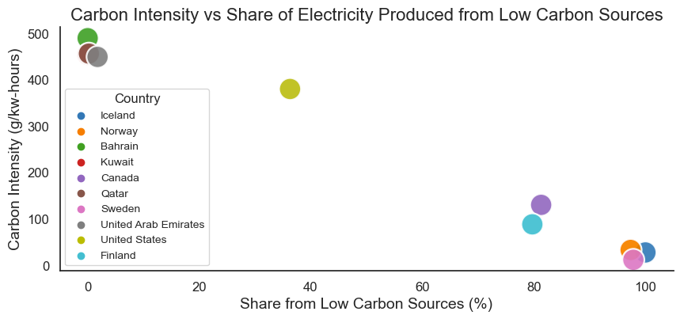
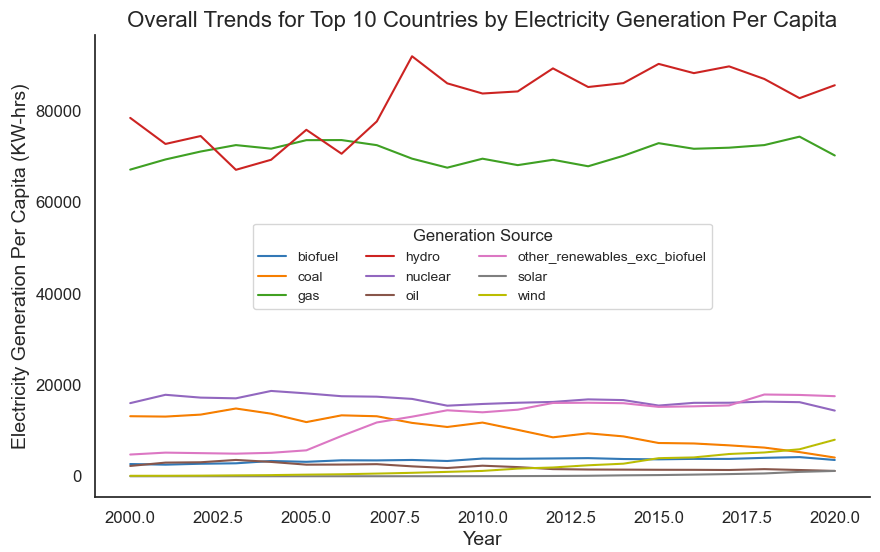
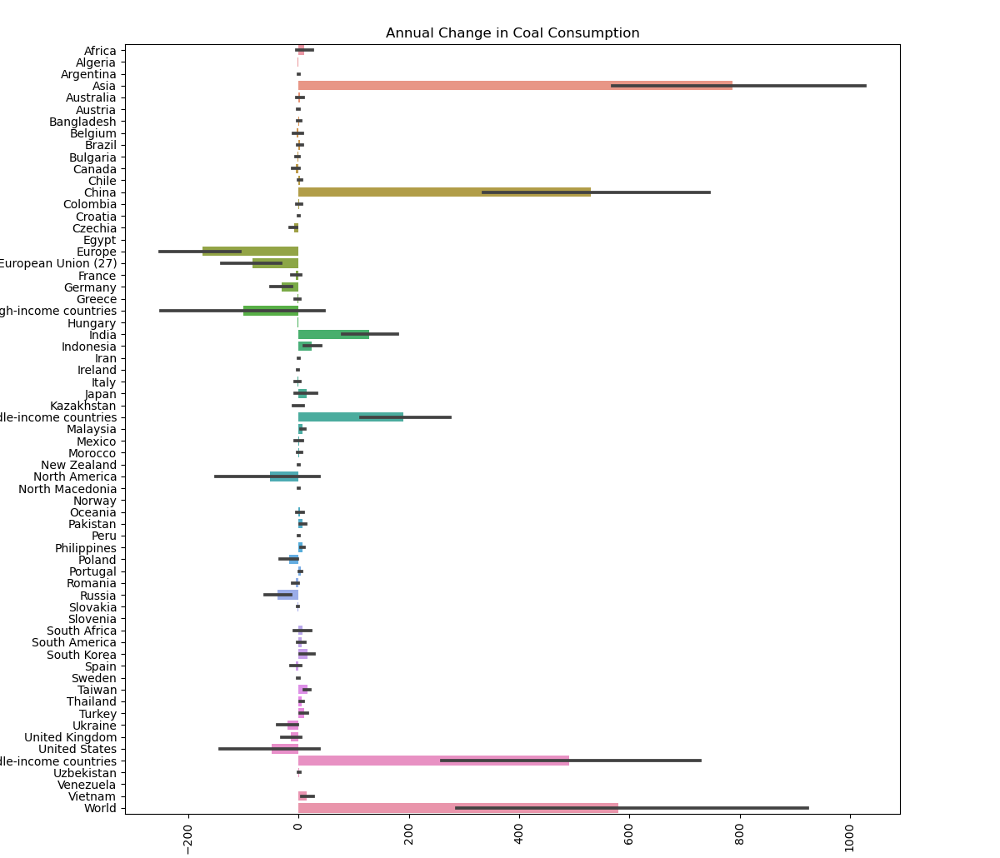
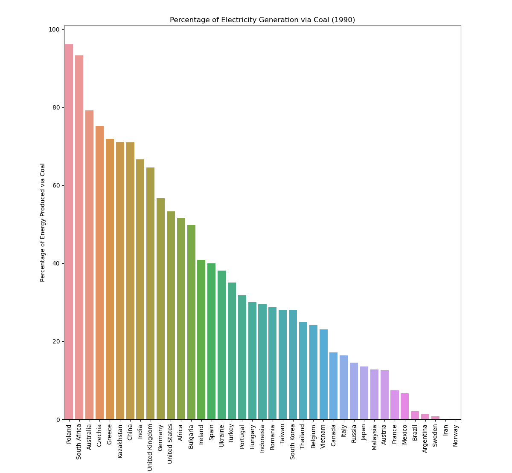
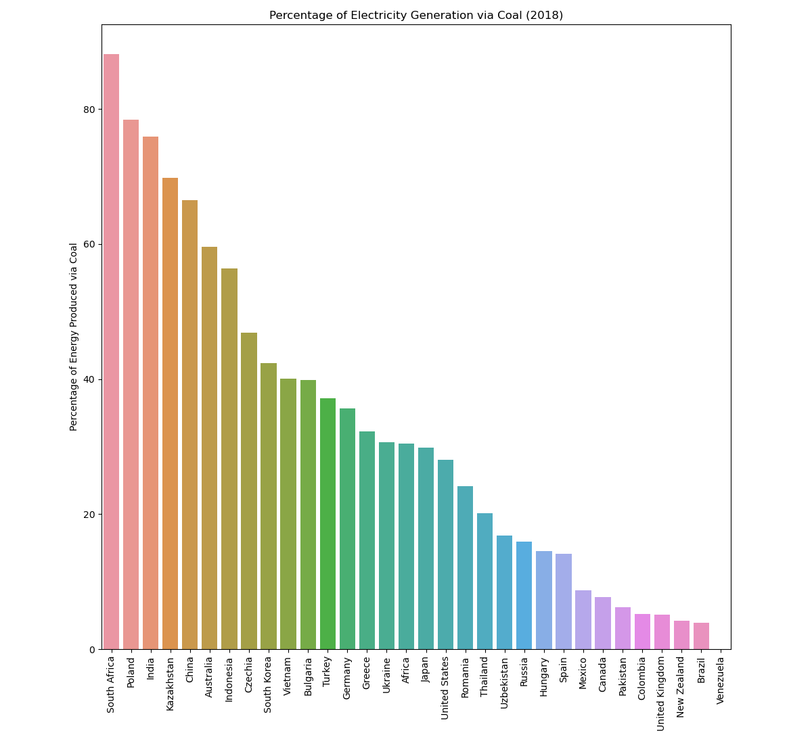
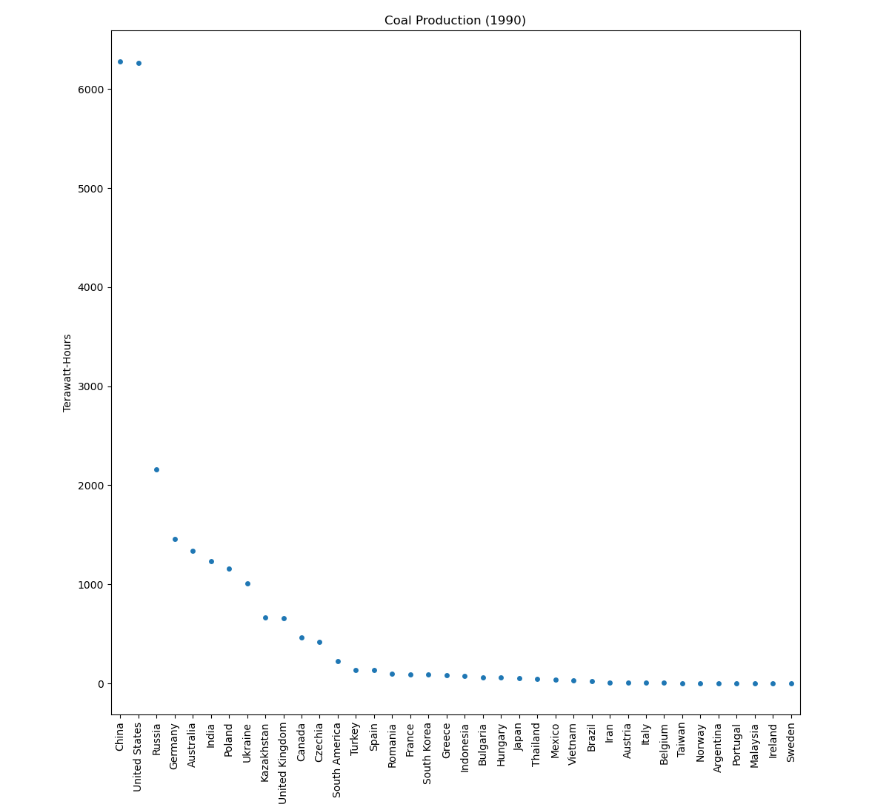

# Final Report - Global Energy Analysis
## Introduction
Energy is one of the big global problems we, as a society, are facing. By analyzing energy consumption data, we can shed more light on our current situation and hopefully provide motivation and evidence to support the effort to move towards net-zero emissions. Alongside this, the topic of global energy was a great interest among our group, thus contributing to the motivation to explore this dataset. This report explores global electricity generation per capita, enery production from coal, and the global availability of clean energy. This dataset is provided by [Our World in Data](https://ourworldindata.org/), a research and database that aims to "make progress against the world's largest problems".

## Analysis 1 - Electricity Generation Per Capita
### Research Questions
1. What are the top 10 countries based on electricity generation per capita and what is their electricity mix?
2. How much of their electricity is generated from low carbon sources (renewables and nuclear)?
3. Is there a correlation between more electricity generated from low carbon sources and decreased carbon dioxide emissions?
4. Is there a trend in these countries to generate more electricity from low carbon sources and phase out non-renewable sources?

### Visualizations
The top 10 countries based on electricity generation per capita and their electricity mix are illustrated in the figure below.

This figure shows the breakdown of each country's electricity mix taken as the average from year 2015 to 2020. The category "other renewables excluding biofuel" includes biomass and waste, geothermal, wave and tidal. We can see Bahrain, Kuwait, Qatar, and the United Arab Emirates are all rich in gas resources. Iceland, Norway, and Canada all have a large supply of electricity generation from hydropower. Norway, Canada, Sweden, United States, and Finland all generate a significant amount of electricity from wind. Iceland is unique in that it is the only country to rely heavily on geothermal electricity generation.

It is interesting to note that the makeup of the top 10 countries by electricity generation per capita includes cold climate countries and countries wealthy in fossil fuel resources. Heating consumes large amounts of electricity, so presumably citizens in the cold climate countries listed in the top 10 use a large share of electricity for heating purposes. The countries wealthy in fossil fuel resources are presumably exploiting their natural resources for profit via energy exports. Further research is needed to determine whether this is the case, or if these countries have high electricity consumption for industrial processes and/or air conditioning.

For geographic context, the map below highlights the top 10 countries and their electricity generation per capita on a colour scale.

Notice Bahrain, Kuwait, Qatar, and the United Arab Emirates are all geographically located in close proximity.

A comparison between electricity generated from all sources versus electricity generated from low carbon sources is made in the next figure. Low carbon sources is a category encompassing nuclear, solar, wind, hydro, biofuel, biomass and waste, geothermal, wave, and tidal.

The main observation from this visualization is the cold climate countries (Iceland, Norway, Canada, Sweden, and Finland) all produce the majority of their electricity from low carbon sources. After analyzing the electricity mix of each country in the previous visualization, it is no surpise that Bahrain, Kuwait, Qatar, and the United Arab Emirates produce almost no electricity from low carbon sources.

The following figure plots the percent share of each country's electricity produced from low carbon sources vs the carbon intensity of electricity production, measured in grams of carbon dioxide emitted per kilowatt-hour.

This figure makes it plain to see the correlation between the percent share from low carbon sources and the carbon emissions from electricity generation. Even though Iceland generates by far the most electricity per capita, it has very low carbon emissions associated with electricity generation because 100% of its electricity generation is from low carbon sources.

The final visualization for this analysis section illustrates the trends for each electricity generation source over a 20 year time span. For this plot, the top 10 countries previously highlighted were combined to find the overall trends.

The following generalized trends for electricity generation sources are observed in the plot above:

| Trending Up | Stable | Trending Down |
| :-: | :-: | :-: |
| Hydro | Gas | Coal |
| Other Renewables | Biofuel | Oil |
| Wind | Nuclear |  |
| Solar |  |  |

Based on these observations, it can be concluded that there is a trend in these countries to generate more electricity from low carbon sources and phase out non-renewable sources. In spite of this generalized trend, gas remains stable as the second largest electricity generation source behind hydro.

The full analysis notebook pertaining to these visualizations, including the code and data, [can be found here.](https://github.com/ubco-W2022T1-cosc301/project-group02/blob/main/notebooks/analysis1.ipynb)

## Analysis 2 - Energy Production from Coal

### Research Questions
In this project, I set out to answer 3 main research questions:

1. Which countries produce the highest percentage of their energy via coal when compared to that country's overall energy mix? Which countries produce the lowest percentage of their energy via coal when compared to that country's overall energy mix?
2. Which country has made the largest reduction in their usage of coal to produce energy between 1990 and 2018?
3. Has the same country dominated coal energy production from 1990 to 2018?
    
Whilst exploring the dataset, nothing jumped out at me since this dataset was from a very reputable source and was created professionally. I kept only the relevant columns through the data wrangling and cleaning process. Below, I will show some of the graphs I created during the exploratory data analysis which will not be used to answer the research questions listed above.

This graph displays the percentage of energy a country produced via coal in 2017 when compared to its' overall energy share mix.

This graph shows the annual change in coal consumption for each country as a sum for all the years of the dataset.

This graph is similiar to the one above, but show the anual change in coal production as a sum for all the years of the dataset.

### Which countries produce the highest and lowest percentage of their energy via coal when compared to that country's overall energy mix? 

In this section, I discovered which countries used coal to produce the most and least amount of their energy. In doing so, I created a graph to show which countries produced the most amount of energy via coal in 1990.

This bar plot shows that, in 1990, Poland, South Africa, and Australia were among the countries which used coal to produce most of their energy. It can be seen that Poland and South Africa produced roughly 90% of their electricity through coal, while Australia's percentage was around 80%. On the other hand, the countries which used the least amount of coal to produce to their energy were Norway, Iran, and Sweden. All of whom which used coal to produce nearly none of their energy.

Alongside this graph, I also created a graph to show the countries and their percentages of electricy generation through coal in 2018.

This bar plot shows that, although they have swapped positions, South Africa and Poland remain the countries which produced the most of their energy by coal in 2018. In third place is now India, with roughly 75% of their energy being generated via coal and Australia has significantly reduced their coal share to around 55%. The countries with the least percentage of their energy generated by coal in 2018 are Venezuela, Brazil, and New Zealand.

The results from this section show that, in 2018, the countries that use coal to produce most of their energy are South Africa and Poland and the countries using coal to produce the least of their energy are Venezuela and Brazil.

### Which country has made the largest reduction in their usage of coal to produce energy between 1990 and 2018?

This section aims to uncover which country has made the largest reduction in their usage of coal to produce energy between 1990 and 2018. I created a graph which shows the net change in a country's coal production between 1990 and 2018.

This graph shows that there are only a few countries that have decreased their coal production between 1990 and 2018, the largest reduction seems to have been made by the United States. To roughly quantify how much, we can see the production of coal by the United States in terawatt-hours in 1990 through this visualization below.

From this visualization, we can see that the United States was the second leading coal producer, with exactly 6260.927 terawatt-hours. Now to see how many Terawatt-hours of coal the United States produced in 2018, let us look at this visualization below.

We can see that the United States is well below the 5000 terawatt-hour mark, with exactly 4277.451 terawatt-hours of coal produced in 2018.

Throughout this section, we discovered that the country that made the largest reduction in coal production was the United States, with a 2033.476 terawatt-hour reduction from 1990 to 2018.

### Has the same country dominated coal energy production from 1990 to 2018?

This last section aims to uncover which country has dominated coal production over the span of 28 years, from 1990 to 2018. In order to anwer this question, I have created a map of the top coal producers from 1990.

This map is a representation of the largest coal producers in 1990, with the shade depicting the amount of coal production. The darker a country, the more coal it has produced. In this map, China and the United States are almost tied in their production of coal, with the difference being only 18.593 terawatt-hours. Now let us compare this map to the 2018 version.

It is very clear that China has clearly become the top coal producer by a great amount. We can see that the United States still remains in second place, but other than that it seems the other countries produced around the same amount of coal. To quantify how much China has increased its' coal production by, I have created a table.

A table of the top coal producing countries in 1990 and 2018:

| Country        | Coal Production (TWh) | Coal Production (TWh) | 
| :---           | :---:                 | :---:                 | 
| China          | 6279.520              | 21352.949             | 
| United States  | 6260.927              | 4277.451              | 
| Russia         | 2158.076              | 2562.787              | 
| Indonesia      | 73.534                | 3822.470              | 

This section has determined that the same country has dominated coal energy production from 1990 to 2018, that country being China. China has increased its' coal production by nearly 3.5 times and produces nearly 5 times as much coal as the United States which is in second in terms of coal production.

The full analysis notebook pertaining to these visualizations, including the code and data, [can be found here.](https://github.com/ubco-W2022T1-cosc301/project-group02/blob/main/notebooks/analysis2.ipynb)

## Analysis 3 - Global Availability of Clean Energy
TBD

The full analysis notebooks pertaining to these visualizations, including the code and data, [can be found here.](https://github.com/ubco-W2022T1-cosc301/project-group02.git)

## Conclusion

Upon completion of the project, the following conclusions were made from the analyses conducted above. In analysis 1, we found that a country's electricity generation per capita is reliant on the climate and natural resources available to a country. We also discovered that the countries which produce the most electricity per capita are either those in colder climates or those rich in resources like gas. Overall, these top electricity per capita producers are trending towards generating more electricity from low-carbon sources and phasing out non-renewable sources. Despite this generalized trend, gas remains stable as the second-largest electricity generation source. Moving onto analysis 2, we uncovered that the countries most reliant on coal to produce their energy were South Africa, Poland, and Australia, while countries that were less reliant on coal for their energy production included Venezuela and Brazil. Analysis 2 also found that not many countries have reduced the amount of coal they use, but among the few that have, the United States has made the largest reduction in their coal usage to produce energy. They made a 2000 terawatt-hour net reduction between 1990 and 2018. Also, we discovered that China dominated coal production from 1990 to 2018, with an increase of almost 3.5 times in this period. From the analysis in analysis 2, it is apparent that coal is still an energy source relied heavily upon by many countries around the world, and there doesn't seem to be a trend of transitioning away from coal any time soon. In doing this project, our group developed valuable skills that will benefit us for years, such as using python, pandas, seaborn, and tableau. Alongside these skills, we have also developed well-rounded fundamentals in data analysis. In conclusion, this project was valuable in terms of overall knowledge, and we hope you enjoy our findings.