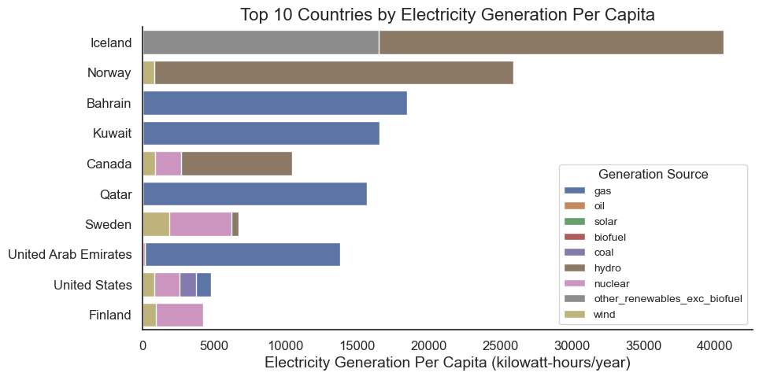
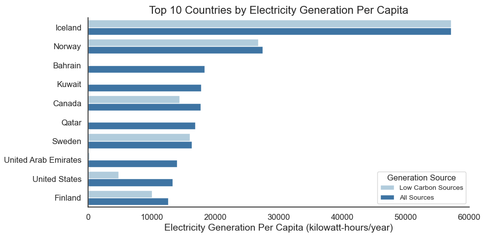
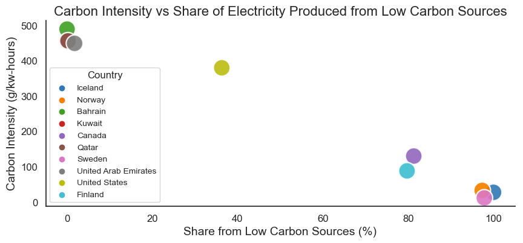
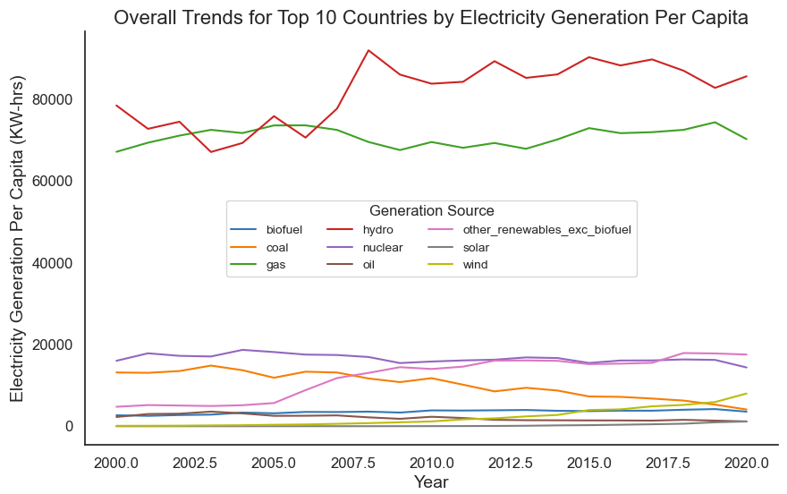

# Analysis 1 - Electricity Generation Per Capita
## Research Questions
1. What are the top 10 countries based on electricity generation per capita and what is their electricity mix?
2. How much of their electricity is generated from low carbon sources (renewables and nuclear)?
3. Is there a correlation between more electricity generated from low carbon sources and decreased carbon dioxide emissions?
4. Is there a trend in these countries to generate more electricity from low carbon sources and phase out non-renewable sources?

## Visualizations
The top 10 countries based on electricity generation per capita and their electricity mix are illustrated in the figure below.

This figure shows the breakdown of each country's electricity mix taken as the average from year 2015 to 2020. The category "other renewables excluding biofuel" includes biomass and waste, geothermal, wave and tidal. We can see Bahrain, Kuwait, Qatar, and the United Arab Emirates are all rich in gas resources. Iceland, Norway, and Canada all have a large supply of electricity generation from hydropower. Norway, Canada, Sweden, United States, and Finland all generate a significant amount of electricity from wind. 

It is interesting to note that the makeup of the top 10 countries by electricity generation per capita includes cold climate countries and countries wealthy in fossil fuel resources. Heating consumes large amounts of electricity, so presumably citizens in the cold climate countries listed in the top 10 use a large share of electricity for heating purposes. The countries wealthy in fossil fuel resources are presumably exploiting their resources to export energy for profit. Further research is needed to determine whether this is the case, or if the countries have high electricity consumption for industrial processes and/or air conditioning.

A comparison between electricity generated from all sources versus electricity generated from low carbon sources is made in the next figure. Low carbon sources is a category encompassing nuclear, solar, wind, hydro, biofuel, biomass and waste, geothermal, wave, and tidal.

The main observation from this visualization is the cold climate countries (Iceland, Norway, Canada, Sweden, and Finland) all produce the majority of their electricity from low carbon sources. After analyzing the electricity mix of each country in the previous visualization, it is no surpise that Bahrain, Kuwait, Qatar, and the United Arab Emirates produce almost no electricity from low carbon sources.

The following figure plots the percent share of each country's electricity produced from low carbon sources vs the carbon intensity of electricity production, measured in grams of carbon dioxide emitted per kilowatt-hour.

This figure makes it plain to see the correlation between share from low carbon sources and the carbon emissions from electricity generation. Even though Iceland generates by far the most electricity per capita, it has very low carbon emissions associated with electricity generation because 100% of its electricity is generated from low carbon sources.

The final visualization for this analysis section illustrates the trends for each electricity generation source over a 20 year time span. For this plot, the top 10 countries previously highlighted were combined to find the overall trends.

The following generalized trends for electricity generation sources are observed in the plot above:

| Trending Up | Stable | Trending Down |
| :-: | :-: | :-: |
| Hydro | Gas | Coal |
| Other Renewables | Biofuel | Oil |
| Wind | Nuclear |  |
| Solar |  |  |

Based on these observations, it can be concluded that there is a trend in these countries to generate more electricity from low carbon sources and phase out non-renewable sources, however the gas remains stable as the second largest electricity generation source behind hydro.

The full analysis notebook pertaining to these visualizations, including the code and data, [can be found here.](https://github.com/ubco-W2022T1-cosc301/project-group02/blob/main/notebooks/analysis1.ipynb)